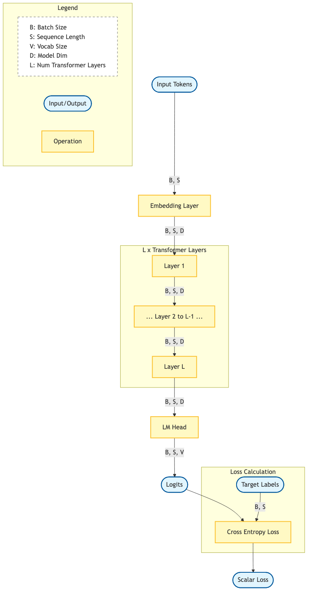
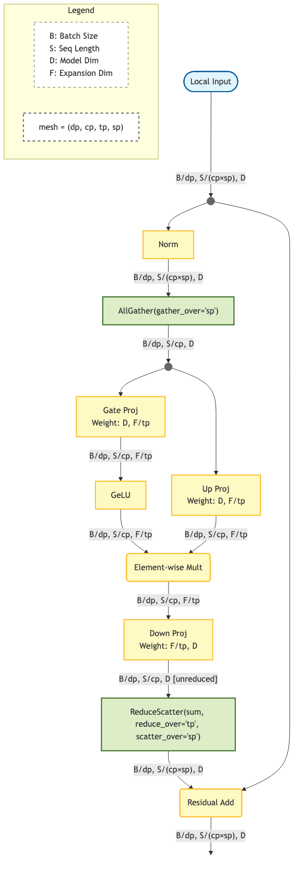

## **Simplicity buried in Abstractions**

I've always loved the ["Transformer Accounting"](https://jax-ml.github.io/scaling-book/transformers/) diagram from the JAX Scaling Book. It did a brilliant job of making the tensor shapes of a Transformer intuitive on a single device.

But as we scale up, the complexity shifts. We stop worrying about just matrix dimensions and start worrying about the 'alphabet soup' of N-D parallelism (DP, TP, SP, CP, EP).

Here is the irony: The core ideas behind these parallelisms are actually **fundamentally easy**. Conceptually, we are just decomposing a global tensor op to local tensor compute with comm collectives. But in practice, this simplicity gets buried under layers of dense abstractions and "spaghetti" implementations in production codebases.

I created the diagrams below to cut through that noise. I want to restore that intuition by visually mapping the dance between **Compute** and **Collectives**. The goal is to show exactly *how* the compute is sharded and *when* the synchronization happens: stripping away the implementation complexity to reveal the simple logic underneath.

## **How to Read Diagrams below**

**The Golden Rule:** To interpret the figures below, imagine you are sitting inside one single GPU.

**Model shape symbols**

| Symbol | Definition | Description |
| :---- | :---- | :---- |
| **B** | Batch Size | Global batch size across all devices. |
| **S** | Sequence Length | Full sequence length (e.g., 4096, 128k). |
| **D** | Model Hidden Dimension | The width of the residual stream. |
| **V** | Vocabulary Size | Total size of the tokenizer vocabulary. |
| **F** | Feed-Forward Dimension | Expansion dimension in MLP (usually 4\*D). |
| **E** | Number of Experts | Total experts in MoE layer. |
| **C** | Capacity | Max tokens per expert (MoE specific). |

**Parallel Configuration (The Sharding Strategy)**

These symbols represent the **size** of the process group (communicator) used to shard a specific dimension.

| Symbol | Definition | Shards What? |
| :---- | :---- | :---- |
| **tp** | Tensor Parallel | Weights (D or F) in Linear Layers |
| **sp** | Sequence Parallel | Activations (S) in Element-wise Ops |
| **cp** | Context Parallel | Sequence (S) in Attention (QKV) |
| **ep** | Expert Parallel | Experts (E) in MoE Layers |
| **vp** | Vocab Parallel | Vocabulary (V) in Embeddings/Loss |
| **dp** | Data Parallel | Batch (B) |

**Reading the "Local Shape"**

You will frequently see this specific shape entering and exiting the major blocks:

[B/dp, S/(cp\*sp), D]

The notation **X/y**: This tells you how the global tensor is cut. It means "Take global dimension X and slice it into y parts."

Read this literally from left to right:

1. **B/dp**: "I only hold a fraction of the Batch." (sliced by Data Parallelism)
2. **S/(cp\*sp)**: "I only hold a tiny fragment of the Sequence." (sliced by both Context and Sequence Parallelism)
3. **D**: "I hold the **full** Hidden Model vector."

## **The Visual Walkthrough**

### Overview
This diagram provides a high-level overview of layers of a Transformer model. Note that for the Feed-Forward Network (FFN) block, I cover both the **Dense** variant (standard MLP) and the **Sparse** variant (Mixture of Experts), as modern large-scale models frequently toggle between these designs.

### **Embeddings**

*   **The Strategy:** Vocab Parallel (VP) → Sequence Parallel (SP)
*   **The Flow:**
    1.  **Input:** We start with tokens sharded by S/(cp\*sp).
    2.  **Lookup:** The embedding weights are sharded across the Vocab dimension (V/vp). This means a local lookup produces partial vectors (many are zeros).
    3.  **The Optimization (The ReduceScatter Trick):** The naive approach would be to AllReduce (to sum the partial embeddings) and then Scatter (to shard them for Sequence Parallelism). Instead, we use a **ReduceScatter**. We sum the partial embeddings from the Vocab Parallel lookup and *immediately* scatter them into the Sequence Parallel dimension. This cuts communication overhead significantly right at the start.

### **Attention**

Here we see the complex interplay of different sequence strategies colliding in one block.

*   **The Strategy:** Tensor Parallel (TP) + Sequence Parallel (SP) + Context Parallel (CP)
*   **The Flow:**
    1.  **Entry (AllGather):** We cannot perform the QKV projection on a sharded sequence. We use AllGather(sp) to temporarily reconstruct the local sequence segment S/cp.
    2.  **Attention (CP):** We use Context Parallelism here. Note that while the Query (Q) is local, the Keys (K) and Values (V) must be gathered over the cp ring (often overlapping computation with communication).
    3.  **Exit (ReduceScatter):** The Output Projection (O Proj) is Row Parallel, meaning it results in partial sums sharded by D. We again use the ReduceScatter trick: we sum the partial results from TP and simultaneously reshard them back into the SP-sharded shape.

### **MLP**

*   **The Strategy:** Tensor Parallel (TP) + Sequence Parallel (SP)
*   **The Flow:**
    1.  **Entry (AllGather):** Reconstruct the sequence segment via AllGather(sp).
    2.  **Compute (TP):** Gate/Up projections (Column Parallel) followed by Down projection (Row Parallel).
    3.  **Exit (ReduceScatter):** Return to the memory-efficient sharded shape, summing partial results and scattering in one go.

### **Mixture of Experts**

This is the most complex diagram. We aren't just sharding tensors; we are actively routing tokens to different devices.

*   **The Strategy:** Expert Parallel (EP) + Tensor Parallel (TP)
*   **The Flow:**
    1.  **Dispatch (AllToAll):** This collective moves tokens from their sequence-sharded owners to their expert-sharded destinations.
    2.  **Inner Parallelism:** Notice that *inside* the expert, we can still apply Tensor Parallelism (F/tp) for each matmul. 
    3.  **Return (ReduceScatter + AllToAll):** We have to ReduceScatter the inner TP results (resolving the partial sums from the expert's Row Parallel output) *before* the final AllToAll returns the tokens to their original rank.

### **Loss**

Calculating Cross Entropy when the vocab is sharded (V/vp) is non-trivial. You cannot simply take a softmax because the denominator requires a global sum.

*   **The Strategy:** Vocab Parallel (VP)
*   **The Flow:**
    1.  **Logits:** Computed via a Local Unembed (Vocab Parallel), resulting in logits sharded by V.
    2.  **Online Softmax:** We perform two distinct collectives:
        *   AllReduce(max): To find the global max for numerical stability.
        *   AllReduce(sum): To calculate the denominator.
    3.  **Target Masking:** Since the targets are on one rank but the logits are sharded, we mask the non-local logits and use AllReduce(sum) to broadcast the correct target logit to the group.

## **Closing Thoughts**

These diagrams represent a snapshot of a common, representative setup found in modern frameworks like Megatron-Core or NVIDIA NeMo. It is not the only way to do it. The goal here is not to prescribe the "perfect" architecture, but to provide a visual language for composing these primitives. The challenge in infrastructure is making these parallelisms easy to understand, debug, and compose without sacrificing the performant timing of those critical collectives.

**A Note on FSDP:**
You might notice FSDP (Fully Sharded Data Parallel) is intentionally left out of this specific accounting. This is because FSDP is fundamentally a memory optimization (sharding weights and optimizer states at rest) rather than a computation parallelism. FSDP gathers the full weights just-in-time for the forward/backward pass, meaning it does not affect the local tensor shapes that participate in the actual compute operations. I might cover FSDP and its interaction with these parallelisms in a follow-up post.
