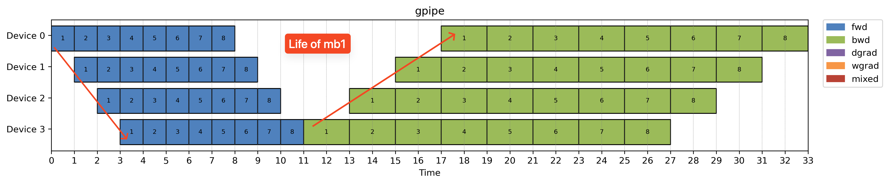
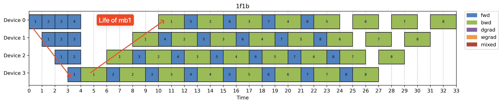
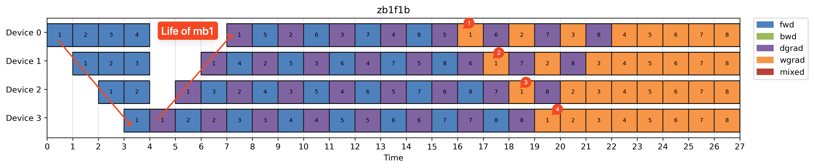
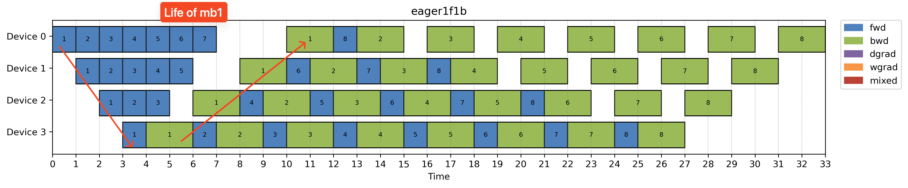
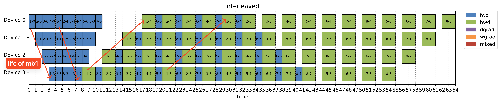
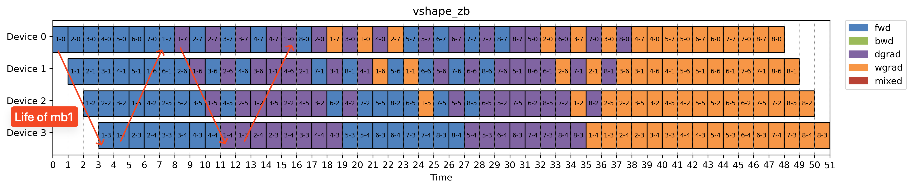
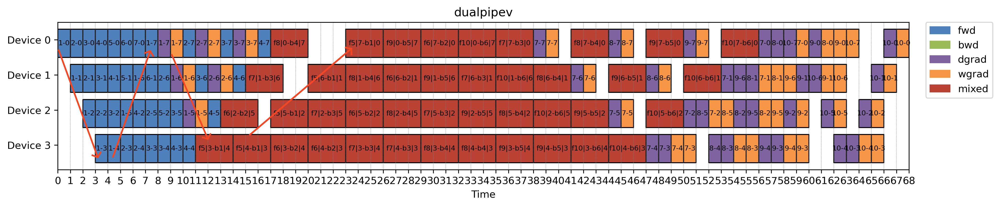
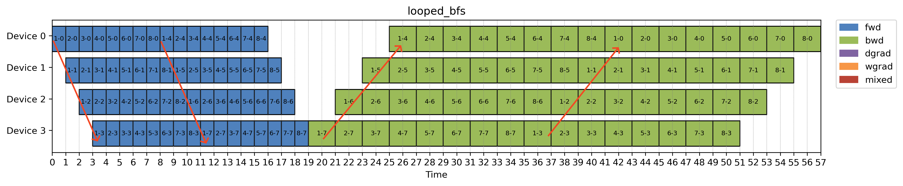

In our book [Efficient PyTorch](https://book.douban.com/subject/37119405/), we gave a quick overview of the main sharding strategies used in large-scale distributed training: data parallelism, tensor parallelism, pipeline parallelism, and a few Transformer-specific ones like expert parallelism and context parallelism.

Pipeline parallelism? It barely got a page.

At the time, I thought it was too intuitive to need much detail. Then last week, I tried explaining all the existing schedules in a clean, logical way—and completely hit a wall.

Those neat diagrams in papers always make it look so straightforward… until you dive in. Then it turns into tangled schedules, weird idle bubbles, and code that’s tightly coupled with other components.

So here’s the chapter that probably should’ve been in the book: an intuition-first, no-formula guide to pipeline parallelism—what it is, why it’s tricky, and how we ended up with so many different flavors of it.

### Bonus point: a toy PP implementation for all schedules

While writing this post, I realized it was surprisingly hard to compare pipeline schedules across papers—everyone presents their plots in slightly different setups, which makes apples-to-apples comparisons tricky. As a result I went down the rabbit hole and built a toy simulator called [minPP](https://github.com/ailzhang/minPP/tree/main).

It’s a lightweight, CPU-only tool that lets you:

- Define arbitrary partitioning + assignment + execution combos
- Simulate step-by-step microbatch flows in timeline
- Visualize schedules in a consistent format

It’s just under 1,000 lines of code, definitely not production grade, still has some rough edges that I haven't got time to fix. But it helped me a lot in understanding and comparing schedules in a clean, structured way. And more importantly: **every plot in this post is generated using it**.

Honestly, I probably spent more time writing the simulator than I would’ve spent drawing the schedules by hand. But hey, now it’s reusable 😅.

# Key questions in pipeline parallelism

Large language models (LLMs) are basically giant directed acyclic graphs (DAGs) of layers—a.k.a. compute graphs in most ML frameworks. Data flows through these graphs step by step, like items on a conveyor belt.

When the model gets too big to fit on a single GPU, but you have multiple GPUs. A natural idea is:

> Break the model into chunks (a few layers each), assign each chunk to a GPU, and stream the inputs through them.

Congratulations—you’ve pipelined your model.But actually making that work in practice boils down to answering three key questions in this section.

To keep things simple, we’ll use the following setup throughout this post:
- 8 layers in the model
- 4 identical GPUs

This makes it easier to compare different partitioning, assignment, and execution strategies side by side.

## How should we partiton the model?

A straightforward partition might be just partition the model to 4 parts:

- [0, 1]: from layer 0 to 1
- [2, 3]: from layer 2 to 3
- [4, 5]: from layer 4 to 5
- [6, 7]: from layer 5 to 7

Each group of consecutive layers like above is called a **pipeline stage**. It's a self-contained unit that handles both forward and backward passes of layers. We use a bracket `[x, y]` to represent a stage's start & end layer(inclusive).

Note that we currently have 2 layers per stage, but you could do 1 layer per stage too, resulting in 8 stages in total. We will see in later sections on how schedules leverage this finer granularity partitions.

## How do we assign stages to GPUs?

Once you'be defined your stages, it's time to assign them to GPUs. The simplest approach is one stage per GPU and assign them sequentially.

But what if you have more stages than GPUs, the assignment ordering can be quite flexible and potentially more interesting. Looping and vshape assignment are the mostly commonly used ones. If we do 8 stages in total(1 layer per stage) they look like below:

|  | Looping assignment | Vshape assignment|
|-----|------------------|--------------------|
| GPU 0   | [0], [4]         | [0], [7]|
| GPU 1   | [1], [5]         | [1], [6]|
| GPU 2   | [2], [6]         | [2], [5]|
| GPU 3   | [3], [7]         | [3], [4]|

Note that there's probably no single "correct" assignment, the way you assign stages to device can impact load balance, communication patterns and even how well you can overlap communication.

## How do we priortize different microbatches?

To avoid idle GPUs (aka pipeline bubbles), we split the input batch into microbatches and schedule them across pipeline stages. Once stages are assigned to devices, we know exactly how a microbatch flows through **across the devices**. But given we have multiple microbatch in flight and each of them might have forward and backward pass to run, and usually the execution takes the GPU exclusively. Here is the main challenge: how do we priortize local execution on each GPU?

Say `forward(i)` is the forward pass of microbatch `i`. On a given GPU:
- `forward(i)` must run before `backward(i)`
- `forward(i)` must run before `forward(i+1)`

But there's still a lot of room for ordering, for example, when both `backward(i)` and `forward(i+1)` are ready, which do you run first?

In general you have two choices here:

| Option          | Description                        | Priority                                  |
|-----------------|------------------------------------|-------------------------------------------|
| Depth first     | Run `backward(i)` first            | Push one microbatch through all stages    |
| Breadth first   | Run `forward(i+1)` first           | Process all microbatches in one stage     |

This choice defines your execution schedule.

> So far, we’ve assumed each stage's forward or backward execution takes the whole GPU exclusively. But some schedules (like DualPipe) can run 1 foward and 1 backward concurrently, and that changes the picture entirely. More on that soon.

# Ready for some real schedules?

Now that we’ve nailed the three knobs: partitioning, assignment, and execution—let’s look at some real schedules.

I’ve always liked those timeline figures in papers. They’re well thought out and show how microbatches flow through devices. But they can be hard to follow when the stage-to-device mapping is hidden. That mapping is usually straightforward, but once you start doing more advanced partitioning or stage allocation, it introduces an extra layer of indirection and makes understanding hard.

To keep things simple, we’ll collapse the layer → stage → device mapping into a direct layer → device mapping. We will continue using the stage notation above. If multiple stages are assigned to one device, they are separated by a comma.

As every pipeline parallelism tutorial seems to do, let’s start with Gpipe and 1F1B, and see if cleanly separating these three questions (partitioning, assignment, execution) helps us better understand how it all works.

## Gpipe and 1F1B

| | Gpipe | 1F1B |
|--------|----------------|-----|
| num_stage_per_GPU |  1  | 1 |
| num_layers_per_stage |  2  | 2 |
| GPU 0 | [0, 1] |[0, 1]|
| GPU 1 | [2, 3] |[2, 3]|
| GPU 2 | [4, 5] |[4, 5]|
| GPU 3 | [6, 7] |[6, 7]|
| Execution order| BFS | DFS |

You can see from the table above that Gpipe and 1F1B only differs in how they priortize execution locally.

### Gpipe

Breadth-first scheduling (BFS) is great for small batch size training. It’s simple to implement and easy to reason about.

But there’s a catch: since BFS keeps all microbatches in flight before any backward pass starts, the memory used for storing intermediate activations builds up. All those tensors need to stay alive until the corresponding backward happens.

So while [BFS based Gpipe](https://arxiv.org/abs/1811.06965) is efficient in terms of throughput, it puts a lot of pressure on peak memory consumption.

You can apply activation checkpointing to reduce memory usage. But that comes at the cost of additional recomputation and slower runtime.

### 1F1B

On the other hand, DFS is much more memory friendly. Switching Gpipe to use DFS is what we called original [1F1B schedule](https://arxiv.org/pdf/1806.03377). Each rank runs 1 Forward + 1 Backward in alternating fashion. DFS allows each GPU to prioritize backward passes over forward passes when both are ready, which reduces the number of activations that need to be held in memory. As noted in the figure.

It’s worth noting: while 1F1B reduces peak memory usage, it doesn’t fix the pipeline bubble problem. You still end up with idle time in the early and late stages of the pipeline.

## Algorithm based optimizations

Before we get to more complex schedules, there're also optimizations coming from some prior knowledge in model architecture that we can leverage. These optimizations can be enabled on top of the 1F1B schedule easily.

| Schedule | Idea|
|--------|----------------|
| Zero bubble 1F1B      | priortize dgrad to execute first since it's on critical path         |
| Eager 1F1B      | takes into data transfer time into accout         |
| DualPipe      | run 1 fwd and 1 bwd simultaneously by overlapping comm & compute      |

### ZB1F1B

[ZeroBubble 1F1B](https://arxiv.org/abs/2401.10241) takes things a step further by looking inside the backward pass.

Each backward consists of two major compute ops:
- dgrad (gradient w.r.t. inputs): needed immediately to unblock the next stage
- wgrad (gradient w.r.t. weights): used only locally

The key insight here is **only dgrad is on the critical path**.
So we can deprioritize wgrad and use it to fill in the idle gaps between critical ops.

This trick can be applied to most schedules—but it’s especially helpful for DFS-style ones, where backward is already prioritized.

### Eager 1F1B

In all the schedules above, we’ve assumed that inter-device communication is instantaneous. As soon as stage `i` finishes its output, stage `i+1` can start right away.

This is a useful simplification for understanding schedules, but in practice, communication time isn’t negligible.

[Eager 1F1B](https://arxiv.org/pdf/2211.05322) addresses this by kicking off computations as early as possible to create opportunities for overlapping communication and computation.

- Helps overlap forward compute and communication
- Does not improve backward overlap
- ️Increases memory usage due to more in-flight microbatches

So, like many things in pipeline parallelism, it’s a trade-off: you gain throughput by overlapping forward stages, but at the cost of higher memory consumption.

### DualPipe: Bidirectional 1F1B

[DualPipe](https://arxiv.org/html/2412.19437v1) (extended from [Chimera](https://arxiv.org/abs/2107.06925)) takes 1F1B optimization in a different direction—literally.

Instead of running a single dataflow from the first stage to the last, it runs two 1F1B schedules simultaneously in opposite directions.
It overlays them into one bidirectional pipeline.

| | DualPipe |
|--------|----------------|
| num_layers_per_stage |  2  |
| num_stage_per_GPU |  2  |
| GPU 0 | [0, 1], [6, 7] |
| GPU 1 | [2, 3], [4, 6] |
| GPU 2 | [4, 5], [3, 2] |
| GPU 3 | [6, 7], [0, 1] |
| Execution order| DFS |

Sounds a bit confusing? Let’s break it down.

- DualPipe is designed to make better use of low-bandwidth interconnects between devices.
- It does this by **running a forward pass and a backward pass at the same time**, but:
  - The forward and backward passes are from different microbatches
  - And from different pipeline directions (normal vs. reversed)

This trick works well in large sparse MoE models, where the All2All communication and GEMM compute take roughly the same amount of time—allowing communication and computation to overlap cleanly.

Of course, nothing comes for free.

- DualPipe doubles the memory footprint, since each device now stores 4 layers instead of 2.
- But in return, it achieves better compute-communication overlap and higher pipeline utilization.

I didn't really implement this schedule, as acknowledged in the [DualPipe repo](https://github.com/deepseek-ai/DualPipe#dualpipev), this schedule can be greatly simplified to DualPipeV schedule we will show below.

## Advanced schedules

| | Interleaved virtual pipeline| Vshape zero bubble| DualPipeV |BFS-looping |
|--------|----------------|-----|-----|----|
| num_layers_per_stage | 1 | 1 | 1 | 1 |
| num_stage_per_GPU |  2  | 2 | 2 | 2 |
| assignment | looping | vshape | vshape| looping|
| GPU 0 | [0], [4] | [0], [7] | [0],[7] | [0],[4] |
| GPU 1 | [1], [5] | [1], [6] | [1],[6] | [1],[5] |
| GPU 2 | [2], [6] | [2], [5] | [2],[5] | [2],[6] |
| GPU 3 | [3], [7] | [3], [4] | [3],[4] | [3],[7] |
| Execution order| DFS | DFS | DFS| BFS|
|Optimization | consider data transfer time | zero bubble | EP | None|

### Interleaved virtual pipeline (Megatron)

The [MegatronLM paper](https://arxiv.org/pdf/2104.04473) introduced a clever way to reduce pipeline bubbles. By dividing the model into smaller stages and assigning multiple stages per device, you can shrink idle time. This schedule is called interleaved 1F1B.

In the example interleaved virtual pipeline above, we basically now have 1 layer per stage but 2 stages per device. To finish one microbatch forward, you'll need to loop over all devices twice(marked in the image). The bubble time is smaller, that comes at the cost of more communication as we have more pipeline stages, we also need to communicate more across devices.

Note in interleaved 1F1B, when we have assign stages to devices, we assign stages by looping over devices. This creates a memory bottleneck on the first device and under utilization of memory on all other device. This imbalance in memory usage can be mitigated by the vshape schedule below.

Also note that interleaved is also takes in data transfer time into account and tries to overlap communication and compute as much as possible.

### Vshape-ZB

The lifespan of a stage is defined as the time between the start of its forward pass and the end of its backward pass.

In both Interleaved 1F1B and V-shape, the execution schedule is the same. The only difference lies in how stages are assigned to devices.

Since peak memory usage is proportional to the stage’s lifespan, the default interleaved schedule (which assigns stages round-robin) can lead to memory hotspots, especially on the first device.

The [V-shape](https://arxiv.org/pdf/2405.15362) assignment fixes this by intentionally collocating:
- Stages with long lifespans
- Stages with short lifespans

This creates a more balanced memory footprint across all devices, reducing bottlenecks without changing the overall schedule behavior.

Note we picked vshape-zb schedule in the paper to show here which also employs zero bubble optimization abov

### DualPipeV

As mentioned above, the 2x memory usage in DualPipe schedule is actually quite expensive. [DualPipeV](https://hackmd.io/@ufotalent/r1lVXsa9Jg) actually shows that the dual memory usuage is not necessary and it can be simplified by cutting in half. Then it can be viewed as a variant of vshape-zb schedule above by running 1 forward and 1 backward simultaneously.

### BFS-looping

While DFS-based schedules (like 1F1B and its variants) dominate in practice, they come with a key limitation. They require a large number of microbatches to fully utilize the pipeline—which isn’t always feasible.

To address this, [breath-first PP paper](https://arxiv.org/pdf/2211.05953) proposed an alternative:
- Use similar virtual pipeline stages as in interleaved but use BFS (instead of DFS) for execution
- Combine it with FSDP and activation checkpointing to reduce peak memory usage.

This combo turns out to be helpful in small batch size settings, where DFS would otherwise stall or waste resources due to insufficient microbatches.

# Common Questions

Q: What if a single layer can’t fit on a GPU?

A: Then PP isn’t enough. You’ll need tensor parallelism (TP), where multiple GPUs jointly run one operation (e.g. matrix multiply).

Q: Why is scheduling so hard?

A: Because you’re solving a data dependency scheduling problem under communication and compute constraints. Minimizing idle time while respecting order is… hard.

Q: Why not automate it?

A: Great idea! In fact, many teams are trying. But a proper scheduler needs to know model structure, compute cost, activation sizes, hardware bandwidths, and more. It’s a compiler problem—but compilers for distributed training are still in early days.

# Closing Thoughts

I don't really expect this post to be as detailed as the papers so I've intentionally excluded all the formulas here. But hopefully it gives you enough intuition to navigate them with more confidence.

At its core, pipeline parallelism is a simple idea. But the implementation is a surprisingly deep rabbit hole.

